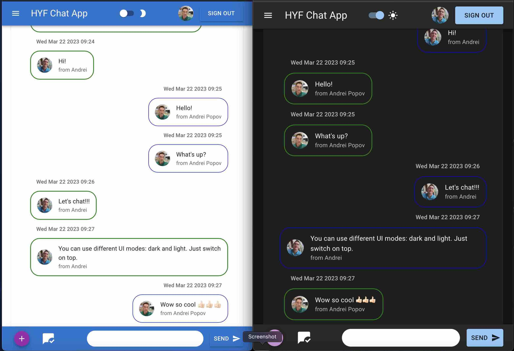

# HYF Chat App

This is a simple chat web application built using React and Firebase. The app allows users to join a chat room and communicate with other users in real-time.

## Screenshot

## Features

- User authentication: Users can sign in and sign out securely using Firebase Google Authentication.
- Real-time messaging: Messages are delivered instantly to all connected users using Firebase Realtime Database.
- Unread messages indicators: Users can see if there unread messages.
- New messages sound notification.
- Adaptive UI. Dark and light modes.
- Emoji support
- Multiple chat rooms: Users can create and join different chat rooms using Firebase Firestore. (under construction)
- There are admin and user levels:
  User: Can send messages create and join chats,
  Administrator: All the above plus clean chat history.

## Installation

1. Clone the repository: `git clone https://github.com/yourusername/your-repo.git`
2. Install dependencies: `npm install`
3. Create a Firebase project and enable Firebase Authentication and Firestore.
4. Add your Firebase config .env file and using variables from `src/utils/firebase.js`.
5. Start the app: `npm start`

## Technologies Used

- React
- Material UI
- Firebase Authentication
- Firebase Firestore

## Demo

A live demo of the app is available [here](https://chat-app-blah-blah.netlify.app/).

## License

This project is licensed under the MIT License - see the [LICENSE.md](LICENSE.md) file for details.
